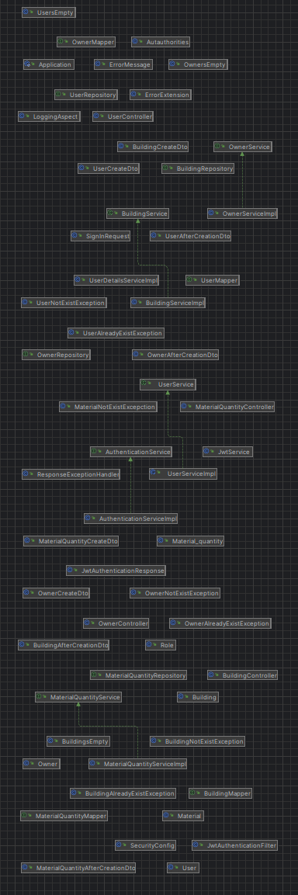
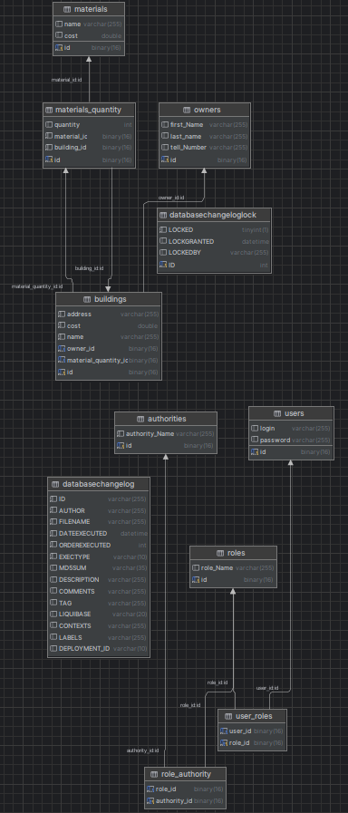

# Construction Project[Backend]

Construction Project is a simple program for monitoring quantity of construction site and quantity of materials on 
these sites, as well as for communication with owners of construction sites.

### Structure of Construction Project

### Database Diagram

### Used technology stack in my web application:
- Spring Boot:
    - spring-boot-starter-data-jpa
    - spring-boot-starter-web
    - spring-boot-starter-security
    - spring-boot-starter-test

- Springdoc OpenAPI:
    - springdoc-openapi-starter-webmvc-ui

- MapStruct:
  - mapstruct и mapstruct-processor

- Liquibase:
  - liquibase-core

- JJWT (JSON Web Token):
    - jjwt-api, jjwt-jackson, jjwt-impl

- Lombok:
  - lombok и lombok-mapstruct-binding

- Databases:
  - mysql-connector-j
  - h2

- JUnit:
    - junit-jupiter

- Maven:
  - maven-compiler-plugin
  - spring-boot-maven-plugin 
  - liquibase-maven-plugin 

